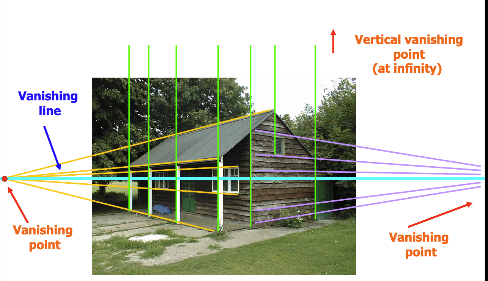
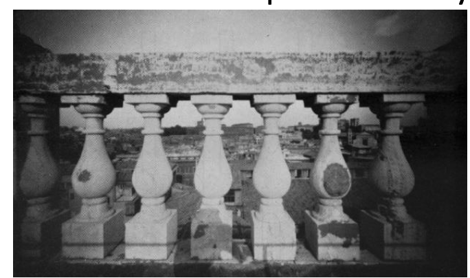
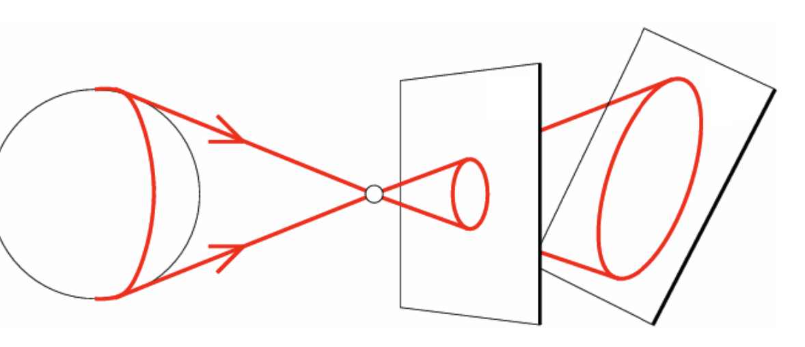
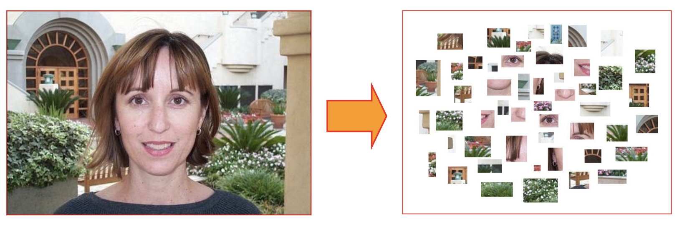
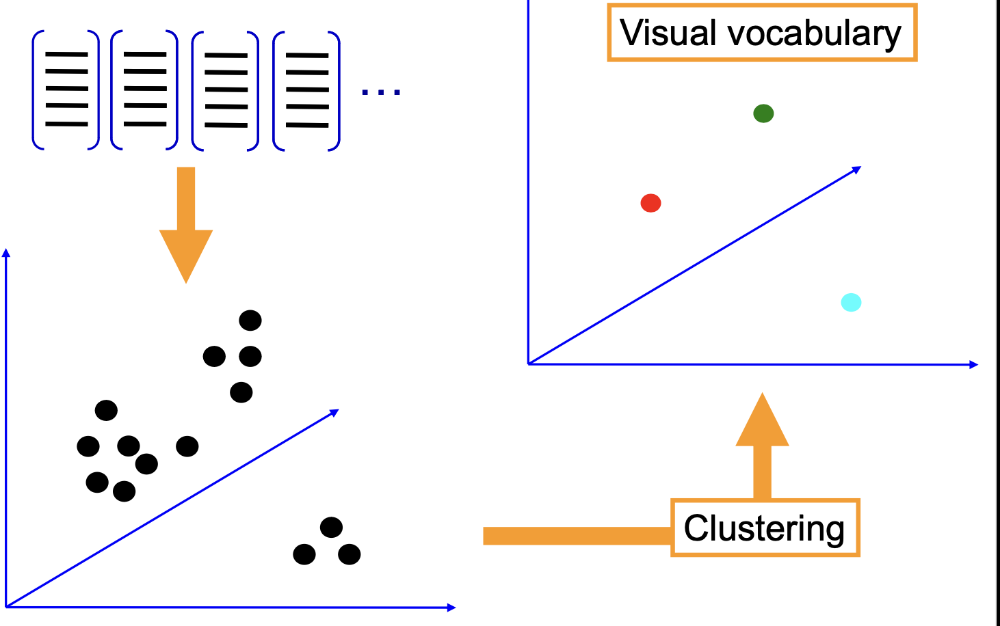

# 计算机视觉笔记

##### Multiclass SVM loss

Given an example $\left(x_i, y_i\right)$ where $x_i$ is the image and where $y_i$ is the (integer) label, and using the shorthand for the scores vector: $s=f\left(x_i, W\right)$
the SVM loss has the form:
$$\begin{aligned}
L_i & =\sum_{j \neq y_i} \begin{cases}0 & \text { if } s_{y_i} \geq s_j+1 \\
s_j-s_{y_i}+1 & \text { otherwise }\end{cases} \\
& =\sum_{j \neq y_i} \max \left(0, s_j-s_{y_i}+1\right)
\end{aligned}$$
<a href="https://sm.ms/image/KHpLEiX4NI7FjVB" target="_blank"></a>

```python
def L_i_vectorized(x,y,W):
  scores = W.dot(x)
  margins = np.maximum(0,scores - scores[y]+1)
  margins[y] = 0
  loss_i = np.sum(margins)
  return loss_i
```

$$L(W)=\frac{1}{N} \sum_{i=1}^N L_i\left(f\left(x_i, W\right), y_i\right)+\lambda R(W)$$

**Data loss:** Model predictions should match training data
**Regularization:** Model should be "simple", so it works on test data

**Occam's Razor**:"Among competing hypotheses, the simplest is the best" William of Ockham, $1285-1247$

In common use:
L2 regularization
$$R(W)=\sum_k \sum_l W_{k, l}^2$$

L1 regularization
$$R(W)=\sum_k \sum_l\left|W_{k, l}\right|$$

Elastic net (L1 + L2)
$$R(W)=\sum_k \sum_l \beta W_{k, l}^2+\left|W_{k, l}\right|$$
scores $=$ unnormalized log probabilities of the classes.
$$P\left(Y=k \mid X=x_i\right)=\frac{e^{s_k}}{\sum_j e^{s_j}} \quad \text { where } \quad s=f\left(x_i ; W\right)$$

$$L_i=-\log P\left(Y=y_i \mid X=x_i\right)$$

#### Convolutional Layer

**Convolve**  the filter with image ,i.e "silde over the image spatcially computing dot products"

<a href="https://sm.ms/image/bM5ykSz3iv4mKUl" target="_blank"></a>

1. **第一层**：输入图像的尺寸是32x32，并且有3个颜色通道。通过使用6个5x5x3的滤波器进行卷积，输出的深度变成了6（因为有6个滤波器），每个滤波器都会产生一个特征图。由于滤波器的尺寸是5x5，所以在每个方向上（宽度和高度），图像的尺寸都会减少4个像素（这是由于没有使用任何填充，且步长为1，所以 32−5+1=2832−5+1=28）。因此，经过第一层卷积后，输出的体积是28x28x6。
2. **激活函数ReLU**：卷积之后通常会接一个激活函数，如ReLU（Rectified Linear Unit），它的作用是增加非线性，使得网络能够学习和表示更复杂的函数。
3. **第二层**：在这个例子中，第二层也是一个卷积层，使用的是10个5x5x6的滤波器。注意这里的滤波器深度是6，与前一层的输出深度相匹配。再次应用卷积会导致每个方向上的尺寸减少4个像素（因为没有填充且步长为1），从而输出的体积变为24x24x10。
4. **空间缩减**：文本提示中提到“空间体积快速缩减不好，效果不佳”（Shrinking too fast is not good, doesn't work well）。这句话的意思是，如果每一层都大幅减小特征图的宽度和高度，那么可能会丢失过多的信息，这可能会对网络识别图像中的模式造成不利影响。

Common settings:
Summary. To summarize, the Conv Layer.
- Accepts a volume of size $W_1 \times H_1 \times D_1$
- Requires four hyperparameters:
- Number of filters $K$,
- their spatial extent $F$,
- the stride $S$,
- the amount of zero padding $P$
$K=$ (powers of 2 , e.g. $32,64,128,512$ )
- $$\mathrm{F}=3, \mathrm{~S}=1, \mathrm{P}=1$$
- $$\mathrm{F}=5, \mathrm{~S}=1, \mathrm{P}=2$$
- $F=5, S=2, P=$ ? (whatever fits)
- $$\mathrm{F}=1, \mathrm{~S}=1, \mathrm{P}=0$$
- Produces a volume of size $W_2 \times H_2 \times D_2$ where:
- $$W_2=\left(W_1-F+2 P\right) / S+1$$
- $H_2=\left(H_1-F+2 P\right) / S+1$ (i.e. width and height are computed equally by symmetry)
- $$D_2=K$$
- With parameter sharing, it introduces $F \cdot F \cdot D_1$ weights per filter, for a total of $\left(F \cdot F \cdot D_1\right) \cdot K$ weights and $K$ biases.
- In the output volume, the $d$-th depth slice ( of size $\mathrm{W}_2 \times \mathrm{H}_2$ ) is the result of performing a valid convolution of the $d$-th filter over the input volume with a stride of $S$, and then offset by $d$-th bias.

- Accepts a volume of size $W_1 \times H_1 \times D_1$
- Requires three hyperparameters:
- their spatial extent $F$,
- the stride $S$,
- Produces a volume of size $W_2 \times H_2 \times D_2$ where:
- $$W_2=\left(W_1-F\right) / S+1$$
- $$H_2=\left(H_1-F\right) / S+1$$
- $$D_2=D_1$$
- Introduces zero parameters since it computes a fixed function of the input
- Note that it is not common to use zero-padding for Pooling layers

<a href="https://sm.ms/image/Z9S5GbInNd1taP3" target="_blank"></a>

**全连接层的特点**：全连接层中的每个神经元都与前一层的所有激活连接。这意味着，如果前一层是一个卷积层或池化层，其所有的输出激活值都将作为全连接层每个神经元的输入。

"池化"（Pooling）是卷积神经网络（CNN）中的一个术语，它指的是一种减小数据维度的操作，同时保留重要信息。这种操作通常应用于卷积层提取的特征图上。池化可以帮助减少计算量，内存使用和参数的数量，这有助于防止过拟合，即模型过于复杂导致的在训练数据上表现良好但在未见过的数据上表现不佳的问题。

池化有几种不同的形式，其中最常见的两种是：

1. **最大池化（Max Pooling）**：在这种类型的池化中，从输入特征图的一个小区域（通常是2x2或3x3的区域）中选择最大的元素作为该区域的代表，并在池化输出中保留这个最大值。这种方法非常有效，因为在许多情况下，特征的存在比它们的精确位置更重要。
2. **平均池化（Average Pooling）**：与最大池化类似，平均池化会计算输入特征图的一个小区域内所有元素的平均值，并将这个平均值用作池化输出。这种方法可以保留区域的背景信息，但不如最大池化突出特征。

##### 批量归一化（Batch Normalization）

$$\hat{x}^{(k)}=\frac{x^{(k)}-E\left[x^{(k)}\right]}{\sqrt{\operatorname{Var}\left[x^{(k)}\right]}}$$

这个公式描述了如何对神经网络中某一层的激活值 $x^{(k)}$ 进行归一化处理。这里：
- $\hat{x}^{(k)}$ 是归一化后的激活值。
- $x^{(k)}$ 是原始的激活值。
- $E\left[x^{(k)}\right]$ 是 $x^{(k)}$ 的均值（期望）。
- $\operatorname{Var}\left[x^{(k)}\right]$ 是 $x^{(k)}$ 的方差。

1. 输入: $\mathbf{B}=\left\{x_1 \ldots x_m\right\}$ 是一个mini-batch, 它包含了 $\mathrm{m}$ 个数据样本。
2. 学习的参数: $\gamma, \beta$ 分别是批量归一化层学习的尺度 (scale) 和偏移 (shift) 参数。
3. 输出: $\left\{y_i=B N_{\gamma, \beta}\left(x_i\right)\right\}$ 是经过批量归一化处理后的数据。
具体的步骤包括：
- 计算mini-batch的均值 $\mu_B$ :
$$\mu_B \leftarrow \frac{1}{m} \sum_{i=1}^m x_i$$
- 计算mini-batch的方差 $\sigma_B^2$ :
$$\sigma_B^2 \leftarrow \frac{1}{m} \sum_{i=1}^m\left(x_i-\mu_B\right)^2$$
- 归一化 $\hat{x}_i$ :
$$\hat{x}_i \leftarrow \frac{x_i-\mu_B}{\sqrt{\sigma_B^2+\epsilon}}$$
- 尺度和偏移 $y_i$ :
$$y_i \leftarrow \gamma \hat{x}_i+\beta=B N_{\gamma, \beta}\left(x_i\right)$$

其中, $\epsilon$ 是一个很小的数, 防止分母为 0 。


- Sigmoid函数历史上非常流行，因为它可以很好地模拟生物神经元的饱和“发射率”。换句话说，它可以模拟一个神经元在不同刺激下的响应方式：在低刺激下几乎没有反应，在中等刺激下反应逐渐增强，在高刺激下反应饱和。

- 尽管Sigmoid函数在历史上很流行，但它有一些缺点，如梯度消失问题（在输入值非常高或非常低时，梯度接近于0，这会导致在训练过程中权重几乎不更新）。
- 此外，Sigmoid函数输出不是以0为中心的，这可能导致网络的优化效率降低

传统Machine-learning 会专家手动设计Feature extraction

classification 降维，耗时，人力，每种application 


很多时候Deep learning 不再需要Validation集了


[paperwithcode][1] 

**PyTorch**：由于其易于理解的编程风格和动态计算图，PyTorch 在研究领域特别受欢迎。它的直观性使得开发新算法和实验新想法变得简单。

**TensorFlow**：相比之下，TensorFlow 在工业界更为流行，尤其是在需要大规模部署的场景中。TensorFlow 提供了一个全面的生态系统，包括用于生产部署的工具和资源。

CVPR,ICCV(全球),ECCV 计算机视觉顶会

1. **初始化太小**：如果权重初始化得太小，那么网络中的激活值（activations）会接近于零，同样的，梯度（gradients）也会接近于零，这会导致网络无法学习。
2. **初始化太大**：如果权重初始化得太大，那么在使用tanh这类激活函数时，网络中的激活值会饱和，这同样会导致梯度接近于零，进而网络无法学习。
3. **初始化正好**：理想的情况是，权重初始化应该使得激活值在所有层中都有一个好的分布，这样可以确保梯度也有一个好的分布，从而使学习过程顺利进行。

## Lec 2 camera

#### 小孔成像模型(Thepinholeprojectionmodel)


并不是所有相交线都是平行的

focal length ( *f* ) 焦距

the distance of the object from the optical center  (*D*) 物镜距离

the distance at which the object will be in focus (*D*′) 像镜距离

##### 景深和光圈的关系

大光圈让更多光线进入，景深浅，背景模糊；小光圈让较少光线进入，景深深，背景更清晰。但是，小光圈降低了曝光量，所以需要通过增加曝光时间或提高ISO来补充光线。

##### FOV（Field of View，视场角）

是指相机镜头能够覆盖的视野范围。它通常以角度来表示，描述了从相机的视点出发，能够看到的空间区域的广度。FOV越大，相机能够捕捉到的场景就越宽广，但同时可能会导致图像中的物体看起来更小或更远。相反，FOV较小则意味着相机的视野范围更窄，可以更加集中地观察到特定的细节，但会捕捉到较少的背景信息。

FOV depends on focal length and size of the camera retina
$$\varphi=\tan ^{-1}\left(\frac{d}{2 f}\right)$$

Larger focal length $=$​ smaller FOV

这个方程是用来计算相机视场角(Field of View, FOV)的，它展示了视场角与焦距（focal length，记为f*f*）和相机感光元件（通常称为相机的“视网膜”或sensor，记为d*d*）大小之间的关系。

- 如果焦距增大（f*f*增大），视场角变小，因为相机的视角更加“放大”或“拉近”了，这通常用于远距离拍摄，比如野生动物摄影或体育摄影中使用的长焦镜头。
- 如果焦距减小（f*f*减小），视场角变大，因为相机的视角更加“缩小”或“拉远”，可以看到更广阔的场景，这通常用于风景摄影或室内摄影中使用的广角镜头。

公式中：

- *φ* 是视场角(Field of View)的一半。
- d 是相机感光元件的对角线尺寸。
- *f* 是镜头的焦距。


No,film上的任何一个点会有各种颜色各种地方的叠加

Projective Geometry

What is lost? • Length • Angles

What is preserved? • Straight lines are still straight

#### 消失点和消失线

##### 消失点的定义：

- 所有平行线都汇聚于一个消失点
  - 空间中的每个方向都与其自己的消失点相关联
  - 例外：平行于图像平面的方向

消失点：在三维世界中的平行线在投影中相交于一点

消失线: 在三维世界中的平行平面相交于一条线

“一个图案在与图像平面平行的平面上的投影会发生什么情况？
- 那个平面上的所有点都位于一个固定的深度z
- 图案会按照f/z的比例进行缩放，但角度和长度/面积的比例是保持不变的。”

非齐次坐标系通常用来表示三维空间中的点。在这个坐标系中，一个点P可以表示为原点 $\mathrm{O}$ 和基向量i、j、k 的线性组合, 其中 $X 、 Y 、 Z$​ 是点P的坐标值。



当我们需要在不同的坐标系中表示同一个点 $P$ 时, 我们可以使用一个旋转矩阵R和一个平移向量 $t$来进行坐标转换。这里, $\overrightarrow{O P}$ 是点 $\mathrm{P}$ 在坐标系 $\mathrm{F}$ 中的位置向量, ${ }^A P$ 是点 $\mathrm{P}$ 在坐标系 $\mathrm{A}$ 中的位置, ${ }^B P$ 是点 $\mathrm{P}$ 在坐标系 $\mathrm{B}$​ 中的位置。

#### 视角失真（Perspective distortion)

被投影的柱子宽度是相等，外部的柱子更宽。这并不是一种光学错觉，也不是由于镜头缺陷造成的。。当我们观看一排并列的物体，比如柱子时，最靠近我们的物体看起来会比远处的物体宽。这是因为我们的视线相对于较近的物体更为散开，这导致它们在我们视网膜上占据更大的空间，尽管它们实际上可能是等宽的。






#### 投影放缩

$$(x, y, z) \rightarrow\left(f \frac{x}{z}, f \frac{y}{z}\right)$$


The same point $P$ in different coordinate systems
$(A)$ and $(B)$ :
$${ }^A \boldsymbol{P}=\mathcal{R}^B \boldsymbol{P}+\boldsymbol{t},$$

Here $\boldsymbol{R}$ is a rotation matrix, $\boldsymbol{t}$​ is a translation vector.

Homogenous Coordinates
Add one more coordinate:
$$\begin{array}{cc}
(x, y) \Rightarrow\left[\begin{array}{c}
x \\
y \\
1
\end{array}\right] & (x, y, z) \Rightarrow\left[\begin{array}{c}
x \\
y \\
z \\
1
\end{array}\right] \\
\text { homogeneous image } & \text { homogeneous scene } \\
\text { coordinates } & \text { coordinates }
\end{array}$$

By introducing homogenous coordinates, we have
$$ { }^A \boldsymbol{P}=\mathcal{T}^B \boldsymbol{P}, \quad \text { where } \quad \mathcal{T}=\left(\begin{array}{cc}
\mathcal{R} & \boldsymbol{t} \\
\mathbf{0}^T & 1
\end{array}\right),
$$
  $$#### 齐次坐标的投影

$p=\frac{1}{Z} \mathcal{M} \boldsymbol{P}$，M包含了想记得内参和相机的外参(和world coordinate 相关)

#### 相机内参（Intrinsic Parameters）

x和y是已像素点作为单位

> 参数与摄像机的物理特性有关，包括像素的大小、成像传感器（如CCD）的中心，以及由于制造误差导致的成像传感器平面的非正交性。

- 图像点 p的坐标 (x,y) 用像素单位表示，而不是米。

- 像素可能是矩形的而非正方形的（即可能有偏斜）。

- 成像传感器的中心通常不与图像的中心 c0 重合。

- 由于制造误差，图像轴之间的角度可能不是 90 度。

- 这里的公式:
  $$%$$
  \begin{aligned}
  & x=k\_f \frac{X}{Z}=k \alpha, \quad \alpha=k\_f \text { and } \beta=l\_f \\
  & y=l\_f \frac{Y}{Z}=l \beta
  \end{aligned}
  $$%$$

  其中 $k$ 和 $l$ 是像素的宽度和高度, $f$ 是焦距， $\alpha$ 和 $\beta$ 是与像素尺寸和焦距相关的缩放因子。

  当传感器的中心不与图像中心对齐时, 坐标 $(x, y)$ 可以用下面的式子修正:
  $$%$$
  \begin{aligned}
  & x=\alpha \hat{x}+x\_0 \\
  & y=\beta \hat{y}+y\_0
  \end{aligned}
  $$%$$

  这里, $x_0$ 和 $y_0$ 表示图像中心的像素坐标。

  \>   1. **视角偏斜**：当传感器的中心偏离图像中心时，图像会出现视角偏斜，即图像的一部分看起来会比另一部分大。这会导致在图像边缘的物体比中心的物体显得更大或更小，从而产生非对称的视觉效果。
  \> 2. **几何畸变**：不对齐可能导致图像的几何形状失真。例如，一个完美的方格可能会在图像上呈现为梯形或其他不规则形状。
  \> 3. **对焦问题**：如果传感器和镜头中心不对齐，可能会导致图像的某些区域无法正确对焦。
  \> 4. **边缘模糊**：由于透视原因，如果传感器不是完全水平，图像的边缘可能会比中心更模糊。

  最后的公式考虑了由于像素轴之间的角度不是正好 90 度的制造误差, 导致像素的轴有一定的倾斜:


$$
\begin{aligned}
  & x=\alpha \hat{x}-\alpha \cot \theta \hat{y}+x_0 \\
  & y=\frac{\beta}{\sin \theta} \hat{y}+y_0
  \end{aligned}
$$


$$
$$%$$$$
  
  
  
  其中, $\theta$ 是两个像素轴之间的角度。当 $\theta$ 等于 90 度时, 上述公式退化为正常的尺度变换和平移变换, 因为 $\cot 90^{\circ}=0$ 和 $\sin 90^{\circ}=1$ 。

1. **Less light gets through** - 如果光圈很小，通过的光量就会减少，这意味着感光元件接收到的光线更少，可能会导致照片曝光不足。
2. **Diffraction effects** - 当光圈非常小的时候，光的衍射效应变得更加明显，这会导致图像失焦，从而降低图像的清晰度。衍射是波（此处指光波）遇到障碍物时发生弯曲的现象，当光穿过一个小光圈时，会产生衍射，影响成像质量。

1. **初始化**：设定迭代次数 N，选择点的数量 s（对于线性拟合 s=2），内点距离阈值 t，以及接受模型所需的最小内点数 d。
2. **随机抽样**：从数据集中随机选择 s 个点（对于线性拟合即随机选择 2 个点），这些点被用来拟合初步的模型（在本例中为直线）。
3. **模型拟合**：通过这 s 个点计算直线的参数（例如，利用最小二乘法）。
4. **内点计数**：计算数据集中每个点到上一步拟合的直线的距离，并确定哪些点的距离小于阈值 t。所有距离小于 t 的点被视为内点。
5. **评估模型**：如果内点的数量达到或超过了 d，那么认为这个模型是有效的，并且使用所有内点重新拟合直线，以获得更准确的模型参数。
6. **迭代**：重复步骤 2 到 5，总共进行 N 次迭代。每次迭代可能会找到不同的内点集合。
7. **选择最佳模型**：在所有迭代中，选择内点数量最多的模型作为最终的拟合结果。

**最小二乘法**提供了一种系统化的方法来估算一组数据点最佳拟合直线的参数，这在统计学和数据分析中是非常有用的。

##### 拜耳滤镜阵列（Bayer Filter Array）

> 因为人眼对绿色的敏感度最高，所以在拜耳阵列中绿色滤镜的数量是红色和蓝色的两倍。这种排列模式也被称为RGBG或GRBG模式。

因为每个传感器像素仅能感知一种颜色，所以需要通过一种叫做去马赛克或者色彩插值的算法来估算出每个像素位置上的完整RGB颜色。这个过程利用了相邻像素的颜色信息来推断缺失的颜色。


$\hat{x}=\frac{X}{Z}$ 和 $\hat{y}=\frac{Y}{Z}$
这里 $X, Y, Z$ 是三维空间中的点 $P$ 的坐标。而 $\hat{x}$ 和 $\hat{y}$ 是点 $P$ 投影到以相机为中心, 与相机光轴 (Z轴) 垂直的平面上的坐标。这个平面称为**归一化图像平面,** 因为它在摄像机的焦距（通常假定为单位距离）上定义。归一化坐标是指在这个假想的平面上, 垂直于光轴并穿过光心（相机的中心点) 的坐标系中的坐标。
$$\hat{p}=\frac{1}{Z}\left(\begin{array}{ll}\mathrm{Id} & 0\end{array}\right) P$$
在这里, $\hat{p}$ 是归一化图像平面上的点的向量表示, 而 $P$ 是三维空间中的点的向量表示。矩阵
$(\mathrm{Id} 0)$ 用于提取 $P$ 中的 $X$ 和 $Y$ 坐标, 并忽略 $Z$ 坐标, 因为在归一化图像平面上, 我们只关心 $X$ 和 $Y$ 的比例。

- $\alpha$ 是 $x$ 轴的缩放系数。 这是将图像的x坐标（即水平坐标）从世界单位（如米）转换为像素单位的系数。它取决于相机的焦距和传感器上每个像素的实际宽度。
- $\beta$ 是 $\mathrm{y}$ 轴的缩放系数。 这是将图像的y坐标（即垂直坐标）从世界单位转换为像素单位的系数。它取决于相机的焦距和传感器上每个像素的实际高度。
- $\theta$ 是 $x$ 轴和 $y$ 轴之间的倾斜角度。
- $x_0$ 和 $y_0$​ 是成像中心在图像坐标系中的位置。

Putting all equations together, we get
$\boldsymbol{p}=\mathcal{K} \hat{\boldsymbol{p}}$, where $\boldsymbol{p}=\left(\begin{array}{l}x \\ y \\ 1\end{array}\right)$ and $\mathcal{K} \stackrel{\text { def }}{=}\left(\begin{array}{ccc}\alpha & -\alpha \cot \theta & x_0 \\ 0 & \frac{\beta}{\sin \theta} & y_0 \\ 0 & 0 & 1\end{array}\right)$.


Here $\mathcal{K}$​​ is called (Internal) calibration matrix of the camera.
$$p=\frac{1}{Z} \mathcal{K}\left(\begin{array}{ll}
\operatorname{Id} & 0
\end{array}\right) \boldsymbol{P}=\frac{1}{Z} \mathcal{M} \boldsymbol{P}, \quad \text { where } \quad \mathcal{M} \stackrel{\text { def }}{=}\left(\begin{array}{ll}
\mathcal{K} & 0
\end{array}\right)$$

1. **旋转矩阵 R**: 它是一个 3x3 矩阵，表示世界坐标系相对于摄像机坐标系的旋转。它定义了一个坐标系到另一个坐标系的方向变换。

2. **平移向量 t**: 它是一个三维向量，表示摄像机原点在世界坐标系中的位置。

   \#\# 相机的外参(Extrinsic Parameters)

   从世界坐标系（通常表示为 W）到摄像机坐标系（通常表示为 C）

   ${ }^C P$ 表示的是摄像机坐标系中的点。
   ${ }^W P$ 表示的是世界坐标系中的点。
   $R$ 是一个 $3 \times 3$​ 的旋转矩阵, 它描述了从世界坐标系到摄像机坐标系所需的旋转。

   在三维空间中, 旋转矩阵通常是 $3 \times 3$ 的, 可以表示为绕三个主轴之一的旋转, 也就是绕 $x 、 y$ 或 $z$ 轴。这些旋转通常用欧拉角 (Euler angles) 来描述, 即绕 $x$ 轴的旋转角 $\alpha$ 、绕 $y$ 轴的旋转角 $\beta$ 和绕 $z$ 轴的旋转角 $\gamma$ 。

   例如, 一个绕 $z$ 轴的旋转角 $\gamma$ 的旋转矩阵 $R_z(\gamma)$ 是这样的:
$$
$$
   R_z(\gamma)=\left[\begin{array}{ccc}
   \cos (\gamma) & -\sin (\gamma) & 0 \\
   \sin (\gamma) & \cos (\gamma) & 0 \\
   0 & 0 & 1
   \end{array}\right]
$$


类似地, 我们有绕 $x$ 轴的 $R_x(\alpha)$ 和绕 $y$ 轴的 $R_y(\beta)$ 。

   $t$ 是一个 3 维的平移向量, 描述了世界坐标系原点到摄像机坐标系原点的距离和方向。
   $p$ 表示图像平面上的点, 而 $Z$ 是 ${ }^C P$ 在摄像机坐标系中的深度（即 ${ }^C P$ 的第三个坐标）。

图片中的公式 $\boldsymbol{C P}=\left(\begin{array}{cc}\boldsymbol{R} & \boldsymbol{t} \\ \mathbf{0}^T & 1\end{array}\right) \boldsymbol{W} \boldsymbol{P}$ 用来将世界坐标系中的点 $\boldsymbol{W} \boldsymbol{P}$ 转换到摄像机坐标系中的点 $\boldsymbol{C P}$ 。这是通过对世界坐标系中的点应用旋转和平移来实现的。
$$T=\left[\begin{array}{cc}
R & t \\
0^T & 1
\end{array}\right]$$

其中, $R$ 是 $3 \times 3$ 的旋转矩阵, $t$ 是 $3 \times 1$ 的平移向量, $0^T$ 是 $1 \times 3$ 的零向量, 1 是一个标量值。这个矩阵 $T$ 可以将三维点从一个坐标系（例如世界坐标系）变换到另一个坐标系（例如摄像机坐标系)。

最后, 通过内参矩阵 $\kappa$ 和外参 $(\boldsymbol{R} \quad \boldsymbol{t})$, 可以得到最终的投影点 $p$, 即 $p=\frac{1}{Z} \boldsymbol{M}$ ，其中 $\boldsymbol{M}$ 是内参矩阵和外参矩阵的结合。这个公式用于将三维空间中的点 $P$ 转换到二维图像平面上的点 $p 。 Z$ 是点 $P$ 在摄像机坐标系中的深度值。

##### Q:为什么光圈越小越清晰？


(1) 只有一束光 最清晰 ，但是特别暗

(2) 太小会发生衍射效应


蓝色点超出景深范围内（单反就是会这样，傻瓜相机就不会）

##### 凸透镜成像规律

![img][image-1]

制景深（depth of field，简称DOF）的原理。景深是指在照片中看起来清晰的那部分区域的范围。这个范围可以通过调整相机的光圈大小来控制。光圈是镜头中的一个可调节的开口，它能影响透过镜头的光线量。

浅景深：

大景深：


- **较大的光圈（上图）**：光圈大时，透过的光线量增加，导致景深较浅。这意味着只有离相机较近的物体会清晰，而远处的物体会变得模糊。这通常用于肖像摄影，以突出主题，背景则故意模糊处理。
- **较小的光圈（下图）**：光圈小时，透过的光线量减少，导致景深较深。这意味着从相机较近到较远的物体都会相对清晰。这通常用于风景摄影，因为它允许整个场景都保持清

- “A smaller aperture increases the range in which the object is approximately in focus”（较小的光圈增加了物体大致清晰的范围）。
- “But small aperture reduces amount of light — need to increase exposure”（但小光圈减少了光线量 — 需要增加曝光时间）


称为光晕（Vignetting，中文有时翻译为晕影）。光晕是由于镜头设计的缺陷或使用上的限制，导致相机拍摄的图片边缘暗于中心部分。

1. **桶形畸变（Barrel Distortion）**：在这种畸变中，图像的中心被压缩，而边缘被拉伸，导致图像看起来像是被包裹在一个桶表面上。这常见于广角镜头，如鱼眼镜头。
2. **枕形畸变（Pincushion Distortion）**：这与桶形畸变相反，图像的边缘向内弯曲，中心部分被拉伸，使得图像看起来像是被嵌入在一个枕头中。这种畸变通常发生在长焦镜头中。

比如红色，感受红光的强度 0\~255 

点积 $S \cdot N$ 的结果是一个标量，表示入射光向量在表面法线方向上的分量，这也等同于入射光和表面法线之间的夹角 $\theta$ 的余弦。当入射光与法线方向一致（垂直入射）时, $\cos \theta$ 的值为 1 , 此时反射光强度最大。当光以越来越倾斜的角度入射时, $\cos \theta$ 的值减小, 反射光强度也随之减小。

图中的插图展示了入射光线以不同的角度照射到两个不同方向的平面上（分别标记为 $A$ 和 $B$ ) 。由于 $B$ 点的表面与光线的入射角更大, 因此根据兰伯特余弦定律, 该点的反射光强度I会小 $A$ 点的反射光强度。

在图中所示的公式 $E=\left[\frac{\pi}{4}\left(\frac{d}{f}\right)^2 \cos ^4 \alpha\right] L$ 中:
- $E$ 表示图像的辐照度（irradiance）, 也就是单位面积上的光通量, 通常用瓦特每平方米表示。
- $d$ 是光圈直径。
- $f$ 是焦距, 即镜头的光心到成像平面的距离。
- $\alpha$ 是光线与光学轴之间的角度, 也就是视场角。
- $L$ 是场景的辐射度 (radiance), 表示特定方向上单位面积上的光通量, 这是一个描述光源亮度的量。

**射度 (Radiance - L)**：

- 辐射度是单位面积（平方米）单位立体角（steradian）的能量流量（瓦特），描述的是从一个点P向另一个点P'发射的光的亮度或强度。

- 辐射度衡量了一束光在特定方向上的亮度，这不仅包括了光的量，还包括了光的方向性。因此，它能够描述光源的定向特性。

- 辐射度考虑了光在空间中的传播方式，因此它通常用于描述从表面或体积中发出或通过的光量

- **辐照度 (Irradiance - E)**：

  - 辐照度是单位面积（平方米）接收到的能量流量（瓦特），描述的是落在点P'上来自透镜的光的量。

  - 辐照度是一个表面在给定时间内接收的光能量的度量。与辐射度不同，它不考虑光的方向性，而是纯粹度量能量本身。

  - 辐照度常用于测量和分析如何以及有多少光照射到了一个表面上，比如太阳对地面的照射。

	#### 


### 推拉变焦

当摄像机向后移动（即远离主体）时，你会增加镜头的焦距（zoom in），而当摄像机向前移动（朝向主体）时，则会减小焦距（zoom out）。

### 球面像差

\#\#\#\# 

- 已知量：源向量 $S_j$ 和像素值 $I_j(x, y)$ 。
- 未知量: 表面法线 $N(x, y)$ 和反照率 (albedo） $\rho(x, y)$ 。
- **反照率（albedo）** 是物体表面反射的光与入射光总量的比率，它是没有单位的，并且对于朗伯表面，是一个常数。
- 朗伯定律（Lambert's law）告诉我们, 朗伯表面的亮度不依赖于观察者的角度。对于给定的光源和表面法线，朗伯表面的像素值 $I_j(x, y)$ 可以通过下面的方程计算:
  $$%$$
  $$%$$
  I\_j(x, y)=k \rho(x, y)\left(N(x, y) \cdot S\_j\right)
  $$%$$
  
  
  
  其中：
  - $I_j(x, y)$ 是图像中点 $(x, y)$ 在第 $j$ 个光源下的像素亮度。
  - $k$ 是相机响应的缩放因子。
  - $\rho(x, y)$ 是点 $(x, y)$ 的反照率。
  - $N(x, y)$ 是点 $(x, y)$ 的表面法线。
  - $S_j$ 是第 $j$ 个光源的方向。
  方程的右侧表示光照模型, 其中 $\left(N(x, y) \cdot S_j\right)$ 是表面法线与光源向量之间的点积, 代表了光源方向和表面法线方向之间的角度关系。点积越大, 意味着表面与光源方向越对齐, 相应的像素就越亮。

##### 漫反射

它是指光线入射到粗糙或不光滑的表面上时，如粉笔或乳胶漆等哑光表面，光线被均匀地向各个方向散射的现象。这种表面由许多微小的面（微小平面）组成，这些面向各个方向随机地散射光线。

## Lec3 light

图中的公式 $I(x)=\rho(x)(S \cdot N(x))$ 是光照强度的计算模型, 它是根据兰伯特余弦定律得出的。根据这个定律, 一个表面上某点的反射光强度与入射光的角度成正比。这里的变量定义如下:

- $\rho$ （读作rho）代表表面的反照率（albedo）, 即表面反射光线的能力, 它是没有单位的比例因子, 取值范围通常在 0 到 1 之间。不同材料的反照率不同,例如雪的反照率非常高, 而煤的反照率非常低。
- $S$ 是光源方向向量，表示光源的位置和方向。
- $N$ 是表面法线（surface normal），表示垂直于表面点的方向。
- $I$ 是该点的反射光强度（reflected intensity）, 表示该点反射的光线强度。
- $\cdot$代表点积 (dot product), 它是一个数学运算, 用来衡量两个向量的相似度。在这个公式中, 点积用来计算入射光向量和表面法线之间的夹角的余弦值。

1. **吸收 (Absorption)**：当光线遇到材料时，部分光能会被材料吸收，转化为其他形式的能量，例如热能。吸收会使通过材料的光强减弱，通常与材料的颜色相关联。例如，一个红色的苹果吸收了除红光以外的大部分光谱。
2. **扩散 (Diffusion)**：扩散是指光线在经过介质（如大气或磨砂玻璃）时方向上的散射。这会导致光线从多个方向传播，产生柔和的阴影和边缘。这是照相机朦胧效果或天空光的柔和效果的原因。
3. **反射 (Reflection)**：当光线从一个介质（如空气）进入另一个不同的介质（如镜子）时，部分光线会被反射回原来的介质。反射分为两种类型：镜面反射（光线以相同的角度反射）和漫反射（光线以多个角度反射）。
4. **透明度 (Transparency)**：透明度是指材料允许光线通过而不被吸收或散射的程度。完全透明的物体，如清水或玻璃，允许光线完全通过，使物体或物体的另一侧清晰可见。
5. **折射 (Refraction)**：折射是指光线在穿过不同折射率介质的界面时，其传播方向发生改变的现象。例如，当光线从空气进入水中时，会朝着垂直于界面的方向偏折，这就是我们在水中看到物体位置看起来“弯曲”的原因。
6. **荧光 (Fluorescence)**：荧光是一种特殊的发光过程，当物质吸收光能（通常是紫外线）后，会以较长的波长（例如可见光）重新发射光能。这就是荧光物质在黑光下发光的原因。
7. **次表面散射 (Subsurface scattering)**：次表面散射是指光线进入物体表面后，在物体内部进行多次散射再重新射出的过程。这种效果常见于如皮肤、蜡、果肉等半透明物质，使其看起来有一种特殊的深度和真实感。
8. **磷光 (Phosphorescence)**：磷光与荧光相似，也是物质吸收光能后再发射光能的过程，但磷光具有延迟特性，即物质在停止接受激发光后，仍能持续发光一段时间，如夜光表或夜光贴纸。
9. **互反射 (Interreflection)**：互反射是指光线在多个表面之间多次反射的现象。这在封闭空间内或物体间距较近时尤其明显，如房间内的墙壁互相反射光线，增加了场景的整体亮度和色彩的复杂度。


### 光度立体测量（Photometric Stereo）

- **Lambertian object**：这指的是一个理想的漫反射表面。

  >  Lambertian表面的特点是它们各向同性地散射入射光——也就是说，光线无论从哪个方向照射到这种表面上，都会以相同的亮度反射。

  满足公式:

  $\begin{aligned} I_j(x, y) & =k \rho(x, y)\left(\mathbf{N}(x, y) \cdot \mathbf{S}_j\right) \\ & =(\rho(x, y) \mathbf{N}(x, y)) \cdot\left(k \mathbf{S}_j\right) \\ & =\mathbf{g}(x, y) \cdot \mathbf{V}_j\end{aligned}$

- **Local shading model**：这是指局部的阴影模型，意味着表面上每一点的亮度仅由对该点可见的光源决定。这忽略了如全局照明、间接光或反射光等复杂因素。

- **Known light source directions**：知道用于照射对象的每一个光源的方向。

- **Set of pictures**：这些是在完全相同的相机和对象配置下，但使用来自不同方向的光源拍摄的一系列图片。

- **Goal**：最终的目标是重建对象的形状（即表面的法线）和反照率（albedo）。

  

  > 这通常通过解析每个像素在不同光照条件下的亮度变化来实现，从而估算出表面法线和反照率。这样，即使物体本身是固定的，通过变换光源方向和分析得到的影像，也可以获取物体表面的详细几何信息。


surface norm 与

法向量 $\mathbf{N}(x, y)$ 表示了曲面在点 $(x, y)$ 处的垂直方向。对于上述曲面, 法向量的计算公式是:
$$
\mathbf{N}(x, y)=\frac{1}{\sqrt{f_x^2+f_y^2+1}}\left(\begin{array}{c}
f_x \\
f_y \\
1
\end{array}\right)
$$


接下来, 通过观察给定的法向量 $\mathbf{N}(x, y)$, 我们可以得到关于 $f_x(x, y)$ 和 $f_y(x, y)$ 的信息。在这里, 我们用 $g_1(x, y), g_2(x, y)$ 和 $g_3(x, y)$ 来表示法向量的三个分量。根据法向量的定义, 我们可以写出:
$$
\begin{aligned}
& f_x(x, y)=g_1(x, y) / g_3(x, y) \\
& f_y(x, y)=g_2(x, y) / g_3(x, y)
\end{aligned}
$$

surface norm 已知,S已知，应该不做要求，是CVPR的一篇论文：P. Nillius and J.-O. Eklundh, “Automatic estimation of the projected light source direction,” CVPR 2001

通过光源来判断是不是假照片:M. K. Johnson and H. Farid, Exposing Digital Forgeries by Detecting Inconsistencies in Lighting, ACM Multimedia and Security Workshop, 2005.


## Lec4 color

#### 什么是颜色？

• 颜色是环境中的物理光与我们的视觉系统相互作用的结果

 • 颜色是我们观看物体和灯光时视觉体验的心理属性， 不是这些物体或光的物理属性

这张图显示的是电磁谱，包括从高频的伽马射线到低频的长波无线电波。上面的图展示了不同类型的电磁波，包括伽马射线、X射线、紫外线、可见光、红外线、微波、调频（FM）和振幅调制（AM）无线电波，以及长波无线电波。电磁波的频率从左边的高频（ν）到右边的低频，波长从右边的长波长（λ）到左边的短波长。

下面的图展示的是人类的视觉相对灵敏度函数，这是一个标准的曲线，展示了人眼对不同波长可见光的感光度。最高点大约在555纳米处，这是黄绿色的光，人眼对这个波长的光最为敏感。曲线两边逐渐下降，表示人眼对紫色端（约400纳米）和红色端（约700纳米）的光相对不太敏感。这段可见光谱是电磁谱中人眼可以感知的部分，也是我们所能看到的“颜色”的来源。


RGB和HSV


> 既然“**三原色的原理不是出于物理原因，而是由于 生理原因造成的**”，那么通常所说的“**用三种原色 的光以不同的比例加和到一起，形成各种颜色的 光**”显然就不大合适。$\textcolor{red}{使用三原色并不足以重现所 有的色彩}$，准确地说法应该是“**将三原色光以不同 的比例复合后，对人的眼睛可以形成与各种频率 的可见光等效的色觉**。”只有那些在三原色的色度 所定义的颜色三角内的颜色，才可以利用三原色 的光以非负量相加混合得到。

1. - 提取并存储每张图片的颜色直方图。颜色直方图是图像中颜色分布的图形表示。
2. **给定新的查询图像**：
   - 提取这张查询图像的颜色直方图。
3. **对于数据库中的每张图像**：
   - 计算查询图像的颜色直方图和数据库中图像的颜色直方图之间的交集。这里的“交集”指的是两个直方图中对应颜色值的最小值。
4. **对交集值进行排序**：
   - 交集值越大，表示查询图像与数据库中图像的颜色分布越相似。
5. **根据交集值排序的顺序对数据库中的图像进行排名**：
   - 交集值最高的图像与查询图像最为相似，因此排在最前面。


#### 分光辐射计

#### 相机标定（Camera Calibration）

**选择标定物**: 在图像中, 我们可以看到一个带有明显格点的标定板, 这些点的三维坐标 $X_i$ 是已知的。
**捕捉图像：**通过摄像头捕捉包含标定板的图像。在图像中, 每个点 $X_i$ 的投影（即图像中的位置) 被标记为 $x_i$ 。
**确定摄影机参数：**使用上述已知的三维点和它们在图像中的二维投影, 我们可以估计摄影机参数。这些参数通常包括内参（如焦距、主点坐标、镜头畸变系数）和外参（如摄影机在全球坐标系中的位置和旋转) 。
**建立数学模型:** $P$ 在示意图中代表摄影机投影矩阵, 它是一个 $3 \times 4$ 矩阵, 用于将三维点转换为二维图像点。通过解决一系列线性方程组, 我们可以求解出这个矩阵。这些方程由以下公式建立: $x_i=P X_i$
其中 $x_i$ 是三维点在图像上的投影（扩展为齐次坐标）， $X_i$​ 是三维空间中的点（同样表示为齐次坐标) 。
优化参数：通常会通过最小化重投影误差（即，算法预测的图像点位置与实际观测到的位置之间的差异) 来优化摄影机参数。

> 在这个步骤中, 我们有一个三维场景中的点 $X_w^{(i)}, Y_w^{(i)}, Z_w^{(i)}$ (其中 $w$ 代表世界坐标系) , 我们知道它在图像上的对应二维点 $u^{(i)}, v^{(i)}$ 。我们想要计算能将三维世界坐标转换到二维图像坐标的摄像机的投影矩阵 $P$ 。
> 
> 矩阵 $P$ 包含了我们想要求解的摄像机参数, 它是一个 $3 \times 4$ 的矩阵, 由 12 个未知数 $p_{11}, p_{12}, \ldots, p_{34}$ 组成。这些参数包含了摄像机的内部特性（如焦距、成像中心等）和外部特性 （如位置和方向）。

$$\left[\begin{array}{c}u^{(i)} \\ v^{(i)} \\ 1\end{array}\right]=\left[\begin{array}{llll}p_{11} & p_{12} & p_{13} & p_{14} \\ p_{21} & p_{22} & p_{23} & p_{24} \\ p_{31} & p_{32} & p_{33} & p_{34}\end{array}\right]\left[\begin{array}{c}X_w^{(i)} \\ Y_w^{(i)} \\ Z_w^{(i)} \\ 1\end{array}\right]$$

$$\begin{aligned} & u^{(i)}=\frac{p_{11} X_w^{(i)}+p_{12} Y_w^{(i)}+p_{13} Z_w^{(i)}+p_{14}}{p_{31} X_w^{(i)}+p_{32} Y_w^{(i)}+p_{33} Z_w^{(i)}+p_{34}} \\ & v^{(i)}=\frac{p_{21} X_w^{(i)}+p_{22} Y_w^{(i)}+p_{23} Z_w^{(i)}+p_{24}}{p_{31} X_w^{(i)}+p_{32} Y_w^{(i)}+p_{33} Z_w^{(i)}+p_{34}}\end{aligned}$$

在计算机图形学和计算机视觉中, 齐次坐标用于方便地表示三维空间中的点和变换。齐次坐标有一个额外的维度（通常表示为 $w$ ），它允许我们用线性代数（矩阵乘法）来表示仿射变换，例如平移，这在普通笛卡尔坐标系中是不可能的。

幻灯片上的等式表明, 齐次坐标 $[\hat{u}, \hat{v}, \hat{w}]^T$ 可以乘以一个非零常数 $k$, 而不改变对应的笛卡尔坐标的点 $\left[\frac{\hat{u}}{\hat{w}}, \frac{\hat{v}}{\hat{\hat{w}}}\right]$ 。换句话说, 尽管 $\hat{u}, \hat{v}, \hat{w}$ 的值可以根据 $k$ 的不同而变化, 但它们代表的二维点的位置不会变。

##### k的意义：

在齐次坐标系统中，一个点的位置可以由多个不同的坐标表示。这些坐标的不同之处在于它们被一个非零常数 k*k* 缩放。这种缩放不会改变点在二维空间中的实际位置。在这个系统中，一个点可以由无限多组坐标来表示，只要这些坐标都是等比例缩放的。常数 k*k* 在这里起的作用是，它展示了即使我们将投影矩阵 P*P* 乘以 k*k*，这个操作所产生的最终2D点仍然是相同的。也就是说，虽然齐次坐标在乘以 k 后看起来数字变大了，但由于它们仍然是等比例的，最终在进行透视除法转换为非齐次坐标时，这个缩放因子 k*k* 会被消除，留下的2D点的实际位置不会改变。

在这个问题中，我们正在寻找一个向量 $\mathbf{p}$，它能够最小化 $|A\mathbf{p}|^2$ 的同时，使得 $|\mathbf{p}|^2=1$。这里 $|\mathbf{p}|$ 表示向量 $\mathbf{p}$ 的二范数，即向量元素平方和的平方根。

幻灯片提供了两种不同的规模设定方式来满足条件 $|\mathbf{p}|^2=1$：

1. 第一种方法是将向量 $\mathbf{p}$ 的第34个元素 $p_{34}$ 设为1。
2. 第二种方法是将向量 $\mathbf{p}$ 的二范数的平方设为1。

为了找到这样的向量 $\mathbf{p}$，我们需要解决一个约束最优化问题。幻灯片给出了这个最优化问题的目标函数，即最小化函数 $\mathbf{p}^T A^T A \mathbf{p}$，同时满足约束条件 $\mathbf{p}^T \mathbf{p}=1$，其中 $\mathbf{p}^T$ 是 $\mathbf{p}$ 的转置。

#### 拉格朗日乘数法
首先讲一下梯度
$$f: \mathbb{R}^n \rightarrow \mathbb{R}数量值函数
(数量场)\\
\vec{f}: \mathbb{R}^n \rightarrow \mathbb{R}^m 向量值函数
(向量场)$$
场:函数选取与坐标系无关
nabla算子/哈密尔顿算子（作用于多元变量）
$$\nabla=\left[\frac{\partial}{\partial x_1}, \frac{\partial}{\partial x_2}, \ldots, \frac{\partial}{\partial x_n}\right]^T$$
$$\nabla f=\left[\begin{array}{c}\frac{\partial f}{\partial x_1} \\ \frac{\partial f}{\partial x_2} \\ \vdots \\ \frac{\partial f}{\partial x_n}\end{array}\right]$$
梯度总与等值面垂直
$$\begin{gathered}\nabla=\left[\begin{array}{c}\frac{\partial}{\partial x_1} \\ \vdots \\ \frac{\partial}{\partial x_n}\end{array}\right] \vec{f}=\left[\begin{array}{c}f_1 \\ \vdots \\ f_n\end{array}\right] \\ \nabla \cdot \overrightarrow{\boldsymbol{f}}=\frac{\partial f_1}{\partial x_1}+\cdots+\frac{\partial f_n}{\partial x_n}\end{gathered}$$
内积/点乘：把向量场变数量场
向量积：
$$\begin{gathered}\nabla=\left[\begin{array}{c}\frac{\partial}{\partial x} \\ \frac{\partial}{\partial y} \\ \frac{\partial}{\partial z}\end{array}\right] \overrightarrow{\boldsymbol{f}}=\left[\begin{array}{l}f_1 \\ f_2 \\ f_3\end{array}\right] \\ \nabla \times \overrightarrow{\boldsymbol{f}}=\left|\begin{array}{ccc}\overrightarrow{\boldsymbol{i}} & \overrightarrow{\boldsymbol{j}} & \overrightarrow{\boldsymbol{k}} \\ \frac{\partial}{\partial x} & \frac{\partial}{\partial y} & \frac{\partial}{\partial z} \\ f_1 & f_2 & f_3\end{array}\right|\end{gathered}$$
#### 最小二乘法解决的优化问题

[1]:	https://paperswithcode.com

[image-1]:	https://pic4.zhimg.com/v2-747a205c0e37c40dc9d17b53b625ee23_b.jpg

## Lec 5 Filter


#### 图像的不同种类


#### 卷积核

###### 符号说明

- *f*：表示图像。
- g：表示卷积核（也称为滤波器或kernel）。

1. 卷积核的大小应该是奇数，这样它就会有一个中心点和一个卷积核半径。这意味着，比如一个3x3的卷积核，它的中心就是(2,2)，就是这个网格的正中间。
2. 卷积核中所有元素的总和应该是1。如果总和大于1，则图像会变亮；如果总和小于1，则图像会变暗。这是因为卷积操作涉及到将卷积核的每一个元素与图像上对应的像素值相乘，并把这些乘积相加来得到新的像素值。如果这些乘积的和大于1，则相当于放大了原像素值；如果和小于1，则相当于缩小了原像素值。
3. 卷积后，有些值可能会大于255或小于0。在图像处理中，RGB每个颜色通道的值是在0到255之间的整数，所以任何超出这个范围的值需要被修剪到这个范围内。如果值小于0，就设为0；如果值大于255，就设为255。这样做是为了避免溢出和数据类型不匹配的错误。

### 线性（Linearity）

线性这个术语是指，如果你对两个函数（在这里可以理解为两个图像或两个信号）应用同一个滤波器，那么无论你是先将这两个函数相加后滤波，还是分别滤波后再相加，结果是一样的。这就像数学中的分配律。

表达式 `filter(f1 + f2) = filter(f1) + filter(f2)` 就是在说：

- `f1 + f2`：首先将两个函数（或图像）相加。
- `filter(f1 + f2)`：然后对结果应用滤波器。
- `filter(f1) + filter(f2)`：或者分别对每个函数应用滤波器，然后把结果相加。


### 移位不变性（Shift Invariance）

移位不变性或平移不变性是指，滤波器对于输入信号的处理不会随着信号在空间或时间上的平移而改变。这意味着如果你将一个函数平移一段距离后再应用滤波器，或者是先应用滤波器再平移，结果应该是一样的。

表达式 `filter(shift(f)) = shift(filter(f))` 说明了这一点：

- `shift(f)`：首先将函数（或图像）平移一段距离。
- `filter(shift(f))`：然后对平移后的结果应用滤波器。
- `shift(filter(f))`：或者是先对函数应用滤波器，然后将滤波后的结果平移相同的距离。

两边的结果应该相同，这就是移位不变性。

#### 图像卷积操作时如何处理图像边缘？

1. **裁剪滤波器（Clip Filter / Black）**: 这种方法是指对于超出图像的那部分窗口，直接赋予一个固定的像素值，通常是黑色，即数值为0。
2. **环绕（Wrap Around）**: 这种方法将图像视为环形结构，即当滤波器超出一个边缘时，就从图像的对面边缘继续采样。
3. **复制边缘（Copy Edge）**: 这种方法是将边缘的像素值复制到滤波器窗口之外，即边缘像素被拉伸填充到外部空间。
4. **边缘反射（Reflect Across Edge）**: 这种方法是将图像边缘的像素值镜像反射到滤波器窗口之外，创建一个对称效果。

##### 脉冲滤波

<a href="https://sm.ms/image/5JehvT23dxsqRG1" target="_blank"></a>
##### 平移

<a href="https://sm.ms/image/1NaheqdOJSMiGWw" target="_blank"></a>
##### Blur

<a href="https://sm.ms/image/yds54qaTpkxMcjt" target="_blank"></a>
##### Sharpen

<a href="https://sm.ms/image/UBZJvGd9yKTOVkC" target="_blank"></a>
##### **盒式滤波器的问题：**

这种方法可能会导致图像边缘出现不自然的效果，因为所有像素被平等对待，不管它们离中心有多远。

使用高斯滤波器来实现，高斯滤波器将权重分配给邻域内的像素，权重按照像素距离中心的远近按照高斯函数递减。这样，中心附近的像素对结果的贡献更大，而远离中心的像素贡献较小。这可以创建更自然的模糊效果，尤其是在边缘附近。

##### 高斯核

>  “支撑”是指一个函数非零的区域。如果一个函数在整个数学空间内都可能不为零，即在任意远的地方它的值都有可能大于零，那么这个函数就被称为具有“无限支撑”。无论 $x$ 取多大或多小的值, 这个函数都会给出一个大于零的结果, 因为指数函数 $e^{-\frac{x^2}{2 \sigma^2}}$ 永远不会等于零。但随着 $x$ 值的增大, 这个函数的值会迅速地趋近于零, 尽管如此, 理论上它从不会完全到达零。这意味着无论你观察多么远的地方, 只要 $x$ 的值不是无穷大, 高斯函数的值都是有定义的, 且大于零。这就是所谓的无限支撑。

图片中的数学公式是高斯函数的二维形式:
$$
G_\sigma=\frac{1}{2 \pi \sigma^2} e^{-\frac{\left(x^2+y^2\right)}{2 \sigma^2}}
$$

这里的 $G_\sigma$ 是高斯核, $\sigma$ 是标准差, 决定了平滑的程度。 $x$ 和 $y$ 表示距离核中心的水平和垂直距离。这个函数在中心处有最大值, 并且随着离中心越远而迅速减小。[已经忘掉的高斯分布](https://zhuanlan.zhihu.com/p/481760712)

图片中还展示了两个不同 $\sigma$ 值的高斯核的三维表示, 以及它们在二维图像上的效果:
- 左侧是 $\sigma=2$ 的高斯核, 核的大小是 30×30。可以看到中心峰值很高, 而且很快就降下去了, 这意味着平滑效果较轻, 保留了较多的细节。
- 右侧是 $\sigma=5$ 的高斯核, 同样核的大小是 30×30。这个核的中心峰值较低, 且下降较慢, 这意味着平滑效果更强, 模糊程度更高, 细节保留得较少。

在应用这样的高斯核于图像时, 核中心附近的像素会对最终结果有较大影响, 而离中心远的像素影响较小。选择合适的 $\sigma$ 值对于达到期望的图像处理效果非常关键。标准差 $\sigma$ 越大, 图像越模糊, 边缘效应越小。相反, $\sigma$ 越小, 图像保留的细节就越多。

### Salt and Pepper Noise（椒盐噪声）

椒盐噪声是一种随机出现的黑白像素点噪声，模拟了图像损坏时的效果，就像图像上洒了盐和胡椒粉一样。这种噪声通常是由图像传感器、传输错误、处理过程中的故障等引起的。椒盐噪声的特点是在图像中随机分布的黑色和白色的尖锐亮点。

处理椒盐噪声的常用方法包括中值滤波器（Median Filter），它通过用像素邻域中的中值替换每个像素值来减少噪声

### Impulse Noise（脉冲噪声）

脉冲噪声或称冲击噪声，主要是随机出现的白像素点，有时也会包含黑像素点，但与椒盐噪声相比，它不一定同时包含黑白两种像素。这种噪声可能是由故障像素、传感器噪声或其他外部干扰引起的。

处理脉冲噪声的策略也可以使用中值滤波器，或者采用自适应滤波器，这种滤波器可以根据噪声的特性调整其处理方式。

### Gaussian Noise（高斯噪声）

高斯噪声是指图像中每个像素的强度变化都符合高斯（正态）分布的噪声。这种噪声在自然界中非常常见，因为许多自然和人造过程都产生正态分布的误差。高斯噪声的特点是对整个图像产生一种均匀的“雪花”效果，而不像椒盐噪声或脉冲噪声那样产生孤立的亮点或暗点。

处理高斯噪声的常用方法包括高斯平滑（Gaussian Smoothing）或双边滤波（Bilateral Filtering）。高斯平滑利用高斯函数作为权重，通过平均邻域内像素的值来减少噪声，而双边滤波则在平滑噪声的同时保留边缘信息。


“中值滤波是线性的吗？”答案是不是。中值滤波是非线性的，因为输出值是由输入像素值的顺序决定的，而不是像素值的线性组合。这使得中值滤波在处理非高斯或椒盐噪声时非常有效，因为它可以在不过分模糊图像的情况下，保留边缘和其他细节。

# Lec 6 Edge detection

>  在图像处理中，我们通常处理的是离散数据，而不是连续函数。在这种情况下，我们使用有限差分来近似偏导数。


例如, 对于 $x$ 方向的一阶差分, 一个简单的滤波器可以是:
$$
\left[\begin{array}{ll}
-1 & 1
\end{array}\right]
$$

或者, 为了对相邻像素取平均, 可能会使用:
$$
\left[\begin{array}{lll}
-1 & 0 & 1
\end{array}\right]
$$

这样的核在卷积操作中使用时，会计算图像中每个点与其右侧相邻点的差值。

当这个滤波器（卷积核）在图像上滑动并应用于图像的每一个像素时，它会计算出一个新的图像，其中的每个像素值都是原始图像中相应位置的像素值和其右边像素值的差。这种操作在图像处理中用于边缘检测, 因为边缘通常对应于像素值的快速变化。


白色代表响应数值最高的颜色

设计了很多中卷积kernel 会得到一个特征图

## Recognition 

- 观察角度的变化 **Viewpoint variation**：一句诗可以很好概括，“不识庐山真面目，只缘身在此山中”。
- 尺度变换 **Scale variation**：图片大小比例的变化也会使得数据发生改变。
- 变形 **Deformation**：很多物体的外形不是一成不变的，比如众所周知，猫是液体。 
- 遮挡 **Occlusion**：要被识别的物体可能被遮挡，只露出一部分。
- 光线条件 **Illumination conditions**：环境光线的变化对物体的图片也会有很大的影响。
- 背景干扰 **Background clutter**：如果物体和背景有很相似的颜色和纹路，那么就很难被识别。
- 物种变异 **Intra-class variation**：同一物种可能也有差异很大的形态。

<a href="https://sm.ms/image/MJOP2tBFcSGACdu" target="_blank"></a>

"Bags of Features"（特征袋）是一种在计算机视觉中常用的方法，特别是在图像分类和检索任务中。这个概念受到自然语言处理中"词袋"模型的启发，其中一篇文档可以表示为它包含的词汇的集合，而不考虑这些词汇在文档中的顺序。

在"特征袋"模型中，图像被描述为局部特征的集合，这些局部特征可以通过不同的方法提取，如SIFT（尺度不变特征变换）、SURF（加速稳健特征）或ORB（Oriented FAST and Rotated BRIEF）等。这些特征被用来代表图像中的关键点，如角点、边缘或斑点等


#### 词频（TF）

词频（TF）指的是某个词语在文档中出现的频率。计算公式是该词在文档中出现的次数除以文档中总词数。这样做的目的是对不同长度的文档进行归一化处理，避免因文档长度的不同而导致的比较偏差。
$$
\mathrm{TF}(t)=\frac{\text { 文档中词条 } t \text { 出现的次数 }}{\text { 文档中的总词条数 }}
$$


#### 逆文档频率（IDF）

逆文档频率（IDF）的目的是减少那些在语料库中频繁出现但对理解文档内容贡献不大的词语的影响（如"的"、"是"等常用词）。它是通过对语料库中包含该词的文档数量取逆并进行对数变换来实现的。具体计算公式为：语料库中文档总数除以包含该词的文档数，然后取对数。
$$
\operatorname{IDF}(t)=\log \left(\frac{\text { 语料库中的文档总数 }}{\text { 含词条 } t \text { 的文档数 }+1}\right)
$$


#### TF-IDF 计算

TF-IDF值是通过将某词的TF值与其IDF值相乘得到的。这个值可以用来评估一个词对于一个文档集合中某一文档的重要性。一个词的TF-IDF值越大，它在该文档中就越重要。这里添加了 1 作为分母, 是为了避免分母为 0 的情况, 这是一种常见的平滑技术。
TF-IDF
将TF和IDF相乘, 得到TF-IDF的公式:
$$
\mathrm{TF}-\operatorname{IDF}(t)=\mathrm{TF}(t) \times \operatorname{IDF}(t)
$$

###### Example(期末要考)

> Consider a document containing 100 words wherein the word *cat* appears 3 times. The term frequency (i.e., tf) for *cat* is ?
>
> Now, assume we have 10 million documents and the word *cat* appears in one thousand of these. Then, the inverse document frequency (i.e., idf) is calculated as ?

$\mathrm{TF}=\frac{3}{100}$ ，$\mathrm{IDF}=\log \left(\frac{10,000,000}{1,000}\right)$

TF-IDF = 0.12

#### Patch



1. **提取局部特征**：这是从图像中识别关键点并描述它们的过程。可以使用SIFT、SURF、ORB等算法来提取这些局部特征。
2. **学习“视觉词汇表”**：一旦从训练集中提取了特征，下一步是构建一个“视觉词汇表”。这通常通过聚类算法（如K-means）完成，聚类算法会将特征归类为"视觉词"。
3. **使用视觉词汇表量化局部特征**：在这一步骤中，将图像中的每个局部特征与视觉词汇表中最接近的词进行匹配，从而为图像创建一个由视觉词频率组成的直方图。
4. **通过“视觉词”的频率表示图像**：最后，图像可以通过它们的“视觉词”直方图表示。这个直方图描述了图像中不同视觉词的分布情况。

<a href="https://sm.ms/image/fsuRnodl3piVeIq" target="_blank"></a>


#### 数据归一化

例子：不同的日历系统

<a href="https://sm.ms/image/zT9cBPIGywWu4Fx" target="_blank"></a>

> 1. **测局部特征（Detect patches）**：图像中的局部特征或“补丁”是指图像中具有独特视觉内容的区域，如角点、边缘或特定的纹理区域。这些特征对于识别和理解图像内容非常重要。在这个例子中，这些特征被标记为白色椭圆形。
> 2. **标准化补丁（Normalize patch）**：一旦检测到局部特征，下一步是将这些特征“标准化”，这通常包括调整它们的尺度、方向和亮度，使特征描述更加稳定，不受图像中不相关因素（如照明变化或视角变化）的影响。标准化的补丁在这里显示为一个灰度图像。
> 3. **计算描述符（Compute descriptor）**：最后，计算每个标准化补丁的描述符。描述符是一个数值向量，它量化了补丁的关键视觉特性，如纹理、颜色或梯度方向。描述符使得计算机能够对图像进行数学处理和分析。

PCA降低维度k-means.

离中心点最近的就是刚刚的基底，就是visual vocabulary




#### K-means 

核心公式：

<a href="https://sm.ms/image/9LIKi6tkNE1sXMr" target="_blank"></a>

- **Level 0**：整个图像作为一个大的区域进行特征提取。
- **Level 1**：图像被分为四个区域（2x2网格），在每个区域提取特征。
- **Level 2**：图像被进一步细分，例如分成16个区域（4x4网格），并在每个小区域内提取特征。

# Lec7 Recognition

##### k-Nearest Neighbor with pixel distance **never used.

1. **被遮挡（Occluded）**：图像中的某些部分被黑色矩形遮挡，这可能会对图像识别产生很大影响，但如果我们仅仅计算像素值的差异，这种遮挡的影响可能并不明显。
2. **移动（Shifted）**：整个图像向某个方向移动了一个像素，这在视觉上几乎是不可检测的，但从像素值的角度来看，这会造成每个像素都有变动，导致高像素距离。
3. **色调改变（Tinted）**：整个图像被添加了一个色调滤镜，虽然这种改变在视觉上是显著的，但在像素级别的距离可能并没有那么大。

###### 1 hot vector 

#### wx+b

<a href="https://sm.ms/image/2hSfioO5ym64A1P" target="_blank"></a>

简化：只有4个pixel，flatten 成一个vector

预测值不是onehot 的 =>那就取最大的

<a href="https://sm.ms/image/Aw9X814J5dlExfI" target="_blank"></a>


SVM:在低维空间不好分的时候，把数据映射到高纬空间去

**"support vectors"**是指那些位于决策边界附近的数据点。简单来说，这些点正好位于分割两个类别的边界上，或者说，它们离决策界限最近。在SVM中，决策边界是通过最大化两个类别之间的边界（或称为边缘）来确定的，而support vectors就是确定这个边界的关键元素。

<a href="https://sm.ms/image/s4U9dq6y8hlMFJ3" target="_blank"></a>

<a href="https://sm.ms/image/LJ95TgreMUPwAjt" target="_blank"></a>

Neural networks: 3 layers
(Before) Linear score function: $\quad f=W x$
(Now) 2-layer Neural Network $\quad f=W_2 \max \left(0, W_1 x\right)$ or 3-layer Neural Network
$$
\begin{gathered}
f=W_3 \max \left(0, W_2 \max \left(0, W_1 x\right)\right) \\
x \in \mathbb{R}^D, W_1 \in \mathbb{R}^{H_1 \times D}, W_2 \in \mathbb{R}^{H_2 \times H_1}, W_3 \in \mathbb{R}^{C \times H_2}
\end{gathered}
$$
(In practice we will usually add a learnable bias at each layer as well)

